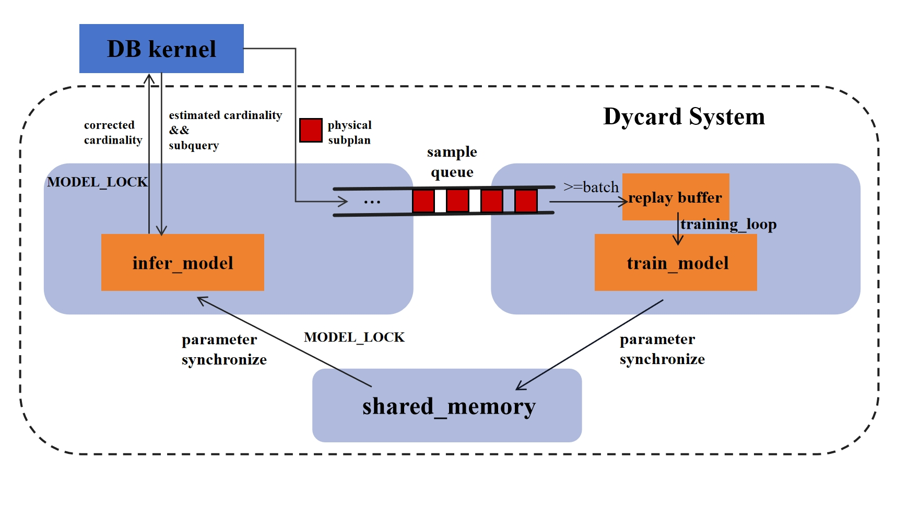

# Dycard: A Lightweight and Deployable Cardinality Refinement System with Online Updates

This project presents the integrated implementation of Dycard, our cardinality refinement system for the open-source database PostgreSQL. Dycard introduces a streaming training and inference framework that continuously improves cardinality estimates in real time by leveraging executed queries as experiential feedback. Instead of replacing the native cardinality estimator, Dycard refines it selectively, with a simple toggle to enable or disable correction, making it easily deployable in real-world production environments. We designed a new query encoding method that captures correlations among table columns within a dataset. This not only enhances correction accuracy but also provides a degree of interpretability for refined estimates.



Extensive experiments demonstrate that Dycard significantly reduces both Q-error and query latency, while generalizing well to unseen queries and adapting to dynamic workloads. Monitoring the system during steady-state operation confirms that Dycard is lightweight, adding negligible overhead to query processing even when correction is enabled.

## Setup

```bash
- Python 3.10.12+

- python3 -m venv dycard
- source dycard/bin/activate
- cd ~/
- git clone https://github.com/hujiatao0/Dycard.git
- cd Dycard
- pip install -r requirements.txt
```
## PostgreSQL Installation and Modification

```bash
- cd ~/
- wget https://ftp.postgresql.org/pub/source/v13.1/postgresql-13.1.tar.bz2
- tar xvf postgresql-13.1.tar.bz2 && cd postgresql-13.1
- patch -s -p1 < ../Dycard/dycard.patch
- ./configure --prefix=/usr/local/pgsql/pg13.1 --enable-depend 
- make -j8 && sudo make install
- echo 'export PATH=/usr/local/pgsql/pg13.1/bin:$PATH' >> ~/.bashrc
- echo 'export LD_LIBRARY_PATH=/usr/local/pgsql/pg13.1/lib/:$LD_LIBRARY_PATH' >> ~/.bashrc
- source ~/.bashrc
```
- You need to create a database data directory whose name is the same with your account name of the Linux system. Suppose your account name is 'user' and your postgresql data directory is '/home/user/pg_data', the commands should be as follows:

```
- initdb -D /home/user/pg_data
- pg_ctl -D /home/user/pg_data start
- psql dbname=postgres

postgres=# create database user;
postgres=# \q
```
then you can use "psql" command in bash to connect to the database.

## Dataset Preparation

We then should import the data and create the some indexes. We use the STATS dataset as an example to reproduce the results and you can find them in the datasets and scripts folders. Run the following commands:
```
- cd ~/Dycard
- psql

user=# create database stats;
user=# \c stats
stats=# \i datasets/stats_simplified/stats.sql
stats=# \i scripts/sql/stats_load.sql
stats=# \i scripts/sql/stats_index.sql
stats=# \q
```

## Observe the results of Dycard

First, We should start the Dycard server and init the model, If you want to build a model from scratch, modify the model save path to your own path, you can start a terminal and run the following command:

```bash
- cd ~/Dycard
- python card_server.py --save_path './new_model/'
```

This command will obtain some basic statistical information of each table in the database and save it, initialize the embeddings of each table and column, and then listen to the Dycard port, which is set to 7655 here, you can change it in config.py. The output information will like follows:

```
Initializing database schema and embeddings...
Database tables:

Table name: users
Column information:
- id (integer)
  Stats: min=-1, max=55747, avg=28037.40, count=40325
- reputation (integer)
  Stats: min=1, max=87393, avg=84.08, count=40325
- creationdate (bigint)
  Stats: min=1279493726, max=1410627704, count=40325
- views (integer)
  Stats: min=0, max=20932, avg=8.91, count=40325
- upvotes (integer)
  Stats: min=0, max=11442, avg=6.59, count=40325
- downvotes (integer)
  Stats: min=0, max=1920, avg=0.26, count=40325

...

Column stats saved to: ./new_model/column_stats.json

Database connection closed
Found 8 tables and 43 columns
Using embedding dimensions: 3 for tables, 7 for columns
Embedders saved successfully

Database embeddings initialized successfully
Model dimension: 17
num_layers: 10
learn_rate: 0.0005
Server listening on port 7655...
```

Also, you can use our pre-trained model to observe the effect of Dycard. It is saved in the ./init_model/ directory, which is the default model path. You can run the following commands:

```bash
- cd ~/Dycard
- python card_server.py
```
It skips the initialization process and the output will like this:

```
Initializing database schema and embeddings...
Column stats loaded from saved file
Found 8 tables and 43 columns
Embedders loaded successfully

Database embeddings initialized successfully
Model dimension: 17
num_layers: 10
learn_rate: 0.0005
Infer model loaded from ./init_model/loss2_layer10_learnrate0.0005_1per_train.pth
Server listening on port 7655...
```

Additionally, our model will be automatically saved after we shut down the server terminal by Ctrl+C, you can find it in the folder as you set, and the output will be like this:

```bash
Ctrl+C
Saving model before exit...
Process Process-1:
Traceback (most recent call last):
  File "/usr/lib/python3.10/multiprocessing/process.py", line 314, in _bootstrap
    self.run()
  File "/usr/lib/python3.10/multiprocessing/process.py", line 108, in run
    self._target(*self._args, **self._kwargs)
  File "/home/user/Dycard/model_manager.py", line 100, in _training_loop
    time.sleep(MONITOR_INTERVAL)
KeyboardInterrupt
Infer model saved to ./init_model/loss2_layer10_learnrate0.0005_1per_train.pth
Model saved successfully.
```

After **the server is running**, we provide the two methods to observe the effect of Dycard.

### 1. Run the experiments in the terminal

In this way, we can clearly observe the interaction between a query and Dycard in the terminal, and see how our cardinality tuning system adjusts the estimated cardinalities between different table columns. Start a new terminal to connect to the database, then set the Dycard port and enable the Dycard:


```
- psql

user=# \c stats
stats=# SET enable_dycard = true;
SET
stats=# SET dycard.port = 7655;
WARNING:  failed to write to socket: Bad file descriptor, str: query: SET dycard.port = 7655;
, port: 7654
SET
```
The warning of changing the port like this is normal, you can ignore it. Then you can run the following query:

```
stats=# explain analyze select count(*) from comments as c, posts as p, posthistory as ph, votes as v, badges as b, users as u where u.id = p.owneruserid and u.id = b.userid and p.id = c.postid and p.id = ph.postid and p.id = v.postid and c.score=0 and c.creationdate<=1410263909 and p.score>=-4 and p.viewcount>=0 and p.viewcount<=5977 and p.answercount<=4 and p.commentcount>=0 and p.commentcount<=11 and p.creationdate>=1295915501 and u.reputation<=312 and u.downvotes<=0;

NOTICE:  cardinality estimation for join [c and p] corrected from 122806 to 122851
NOTICE:  cardinality estimation for join [c and ph] corrected from 637437 to 637784
NOTICE:  cardinality estimation for join [c and v] corrected from 1054416 to 1054713
NOTICE:  cardinality estimation for join [p and ph] corrected from 276437 to 276559
NOTICE:  cardinality estimation for join [p and v] corrected from 299119 to 299236
NOTICE:  cardinality estimation for join [p and b] corrected from 2915954 to 2917375
NOTICE:  cardinality estimation for join [p and u] corrected from 80253 to 80281
......


NOTICE:  cardinality estimation for join [c and p and v and b and u] corrected from 14593414 to 14600569
NOTICE:  cardinality estimation for join [p and ph and v and b and u] corrected from 32855973 to 32873336
NOTICE:  cardinality estimation for join [c and p and ph and v and b and u] corrected from 48129544 to 48154980

QUERY PLAN
......

```

You can see the estimated cardinalities of each join operation are adjusted by Dycard. And in the Server terminal, you can see the process of adding training samples and updating the model. Samples will be automatically added to the sample queue, then the model will be trained and the parameters will be updated to the inference model by shared memory when the number of samples in the queue is greater than the batch size, the default batch size is 32, and you can reduce it in the config.py file to make the training process more frequent.

```bash
Server:

Added training sample: tables=['v', 'c', 'p', 'ph', 'b', 'u'], estimated_rows=48154980, actual_rows=3964936
Added training sample: tables=['v', 'c', 'p', 'ph'], estimated_rows=1445652, actual_rows=1758825
Added training sample: tables=['c', 'p', 'ph'], estimated_rows=405130, actual_rows=436107
Added training sample: tables=['c', 'p'], estimated_rows=122851, actual_rows=114361
Added training sample: tables=['b', 'u'], estimated_rows=76455, actual_rows=55970
Added training sample: tables=['b'], estimated_rows=79851, actual_rows=79851
Added training sample: tables=['u'], estimated_rows=38590, actual_rows=39111

......

Parameters synchronized to shared memory

```

### 2. Run the workload by script

We provide a script to run the workload and observe the performance of Dycard. You can use our pre-trained model parameters:

```bash
Server:

- cd ~/
- source dycard/bin/activate
- cd Dycard
- python card_server.py
```

And in another terminal, run the workload in test mode, this mode will not train model and update the parameters but only correct the estimated cardinalities for each query, our test workload is stats_800.sql, it contains 800 unseen queries:

```bash
- cd ~/
- source dycard/bin/activate
- cd Dycard
- python run.py --test_mode
```
After that, you can rerun this workload in baseline mode, which does not use Dycard to correct the estimated cardinalities:

```bash
- cd ~/
- source dycard/bin/activate
- cd Dycard
- python run.py --baseline --test_mode
```

The logs will be saved in the ./logs/ directory. Our query latency and Q-error results will significantly outperform the baseline.

Also, you can train a new model from scratch:

```bash
Server:

- cd ~/
- source dycard/bin/activate
- cd Dycard
- python card_server.py --save_path './new_model/'
```
In another terminal, run your workload for training, just use stats_800.sql as an example:

```bash
- cd ~/
- source dycard/bin/activate
- cd Dycard
- python run.py 
```

and you can also run the baseline workload for training as a comparison to see how Dycard incrementally corrects the cardinality estimate through the stream of executed queries.

```bash
- cd ~/
- source dycard/bin/activate
- cd Dycard
- python run.py --baseline
```
You can also change the hyperparameters in the config.py file to make better performance. The **num_layers** is the number of attention layers in the Dycard model, more layers means more inference time, but it can deal with more complex schema of dataset. **num_epochs_per_train** is the number of training epochs for queries in replay buffer in each training process. Too large **num_epochs_per_train** will lead to overfitting, but too small **num_epochs_per_train** will lead to insufficient training of the existing data. **max_sample_queue_size** is the maximum number of samples in the sample queue. **max_buffer_size** is the maximum number of samples in the replay buffer, which is used to store the training samples. 
Too large **max_buffer_size** may result in the presence of old samples, but too small **max_buffer_size** may result in insufficient training of the executed samples. **delta_weight** and **learning_rate** are also important hyperparameters which may affect the performance of Dycard a lot.


